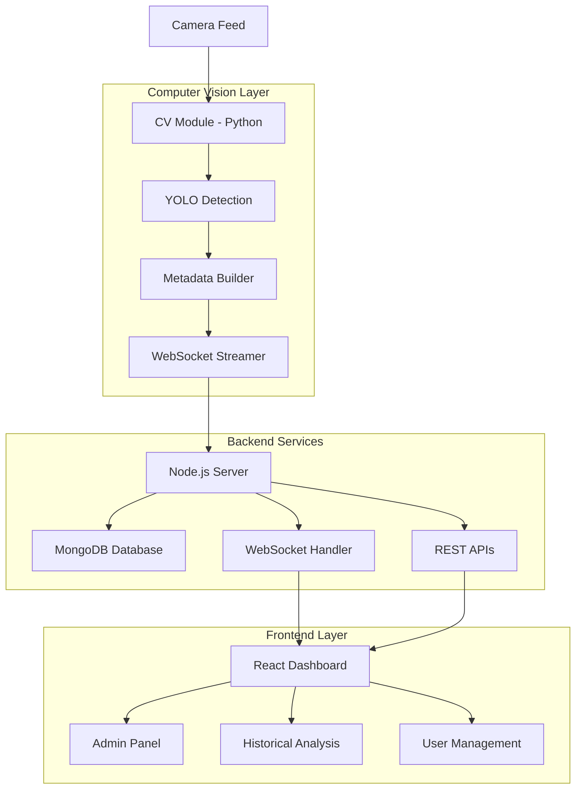
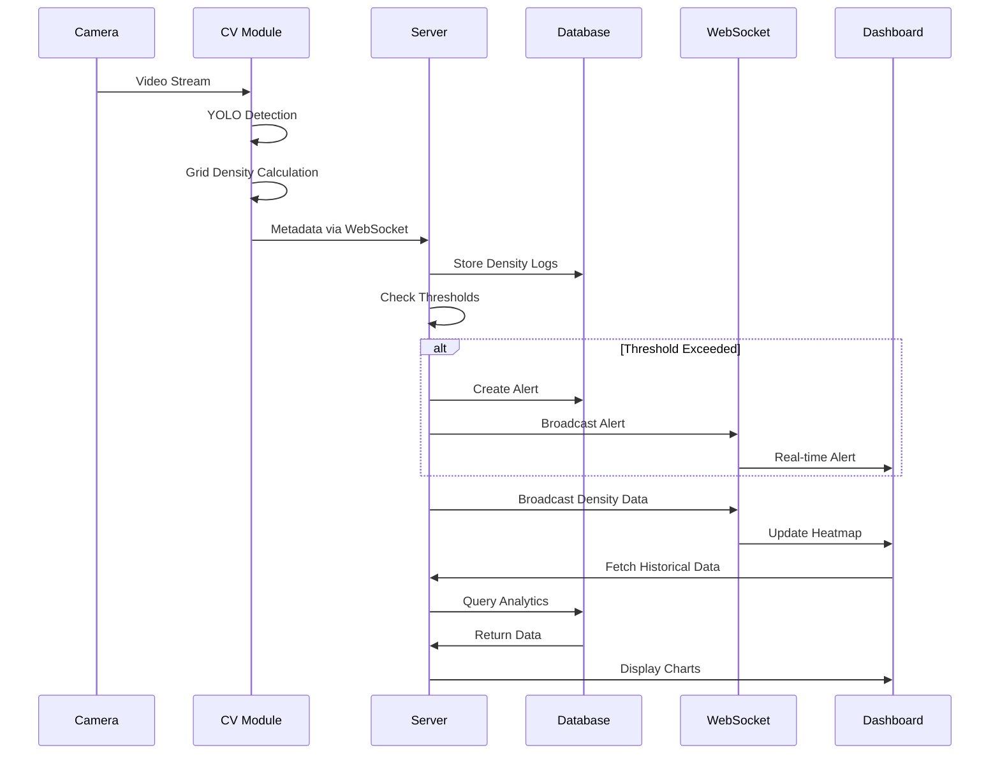

# CrowdCrawl - Real-Time Crowd Monitoring System

## 🚀 Overview

CrowdCrawl is a comprehensive real-time crowd density monitoring system that uses computer vision and AI to track crowd density in public spaces. The system provides live dashboards, heatmaps, alerts, and analytics to help event organizers, security personnel, and venue managers make informed decisions about crowd management.

## 🏗️ System Architecture



## 🔧 Technology Stack

### Frontend
- **React 18** - Modern UI framework
- **Vite** - Fast build tool and dev server
- **Tailwind CSS** - Utility-first styling
- **Zustand** - State management
- **Lucide React** - Icon library
- **React Router** - Client-side routing

### Backend
- **Node.js** - Runtime environment
- **Express.js** - Web framework
- **MongoDB** - NoSQL database
- **Mongoose** - ODM for MongoDB
- **Socket.IO** - Real-time communication
- **JWT** - Authentication
- **Winston** - Logging

### Computer Vision
- **Python 3.8+** - Programming language
- **OpenCV** - Computer vision library
- **YOLOv8** - Object detection model
- **Socket.IO Client** - WebSocket communication

## 📁 Project Structure

```
CodeVerse-3.0/
├── client/                 # React frontend application
│   ├── src/
│   │   ├── components/     # Reusable UI components
│   │   ├── pages/         # Main application pages
│   │   ├── store/         # Zustand state management
│   │   ├── services/      # API and WebSocket services
│   │   └── utils/         # Utility functions
│   ├── public/            # Static assets
│   └── package.json
├── server/                # Node.js backend server
│   ├── controllers/       # Request handlers
│   ├── models/           # Database schemas
│   ├── routes/           # API route definitions
│   ├── middleware/       # Express middleware
│   ├── services/         # Business logic
│   ├── websockets/       # WebSocket handlers
│   ├── config/           # Configuration files
│   └── utils/            # Helper functions
├── cv/                   # Computer vision module
│   ├── main.py           # Main CV application
│   ├── detector.py       # YOLO detection logic
│   ├── video_reader.py   # Camera/video processing
│   ├── metadata_builder.py # Data processing
│   ├── websocket_streamer.py # WebSocket client
│   └── config.py         # CV configuration
└── README.md
```

## 🚀 Quick Start Guide

### Prerequisites

- **Node.js** 16+ and npm
- **Python** 3.8+
- **MongoDB** (local or cloud)
- **Camera** (USB webcam or IP camera)

### 1. Clone Repository

```bash
git clone <repository-url>
cd CodeVerse-3.0
```

### 2. Backend Setup

```bash
cd server
npm install

# Create environment file
cp .env.example .env
# Edit .env with your MongoDB connection string and JWT secret

# Start the server
npm run dev
```

### 3. Frontend Setup

```bash
cd client
npm install

# Start the frontend
npm run dev
```

### 4. Computer Vision Setup

```bash
cd cv
pip install -r requirements.txt

# Start camera detection (USB camera)
python main.py --camera 0 --id CAM_01

# Or start with IP camera/phone
python main.py --rtsp "http://192.168.1.100:8080/video" --id PHONE_01
```

### 5. Access Application

- **Frontend**: http://localhost:5173
- **Backend API**: http://localhost:5000
- **Login**: Use the admin credentials created during setup

## 📊 System Flow Diagram



## 🧪 Testing Guide

### 1. System Health Check

#### Backend API Testing
```bash
# Check server status
curl http://localhost:5000/api/health

# Test authentication
curl -X POST http://localhost:5000/api/auth/login \
  -H "Content-Type: application/json" \
  -d '{"email":"admin@example.com","password":"your-password"}'
```

#### Database Connection
```bash
# Check MongoDB connection in server logs
npm run dev
# Look for "✓ MongoDB connected successfully"
```

### 2. Computer Vision Testing

#### Camera Detection Test
```bash
cd cv
python test_system.py
```

#### JSON Output Validation
```bash
cd cv
python test_json.py
```

#### Phone Camera Setup
```bash
cd cv
# Follow instructions in PHONE_CAMERA_SETUP.md
python test_phone.py
```

### 3. Frontend Testing

#### Component Testing
```bash
cd client
npm run test
```

#### End-to-End Testing
```bash
cd client
npm run test:e2e
```

### 4. Integration Testing

#### Complete System Test
1. **Start all services**:
   ```bash
   # Terminal 1: Backend
   cd server && npm run dev
   
   # Terminal 2: Frontend  
   cd client && npm run dev
   
   # Terminal 3: CV Module
   cd cv && python main.py --camera 0 --id CAM_01
   ```

2. **Verify WebSocket Connection**:
   - Check browser console for WebSocket connection
   - Verify real-time data updates in dashboard

3. **Test Alert System**:
   - Set low thresholds in admin panel
   - Move multiple objects in camera view
   - Verify alerts appear in real-time

4. **Validate Data Flow**:
   - Check MongoDB for density logs
   - Verify heatmap updates
   - Test historical analytics

### 5. Performance Testing

#### Load Testing
```bash
# Install artillery
npm install -g artillery

# Run load tests
artillery run test/load-test.yml
```

#### Memory Usage Monitoring
```bash
# Monitor CV module memory usage
cd cv
python -m memory_profiler main.py --camera 0 --id CAM_01
```

## 📋 Key Features

### Real-Time Monitoring
- **Live Heatmaps**: Visual density representation
- **Multi-Camera Support**: Monitor multiple venues
- **WebSocket Updates**: Sub-second data refresh
- **Detection Overlays**: Bounding box visualization

### Alert Management
- **Threshold Configuration**: Warning and critical levels
- **Real-Time Notifications**: Instant alert delivery
- **Alert Acknowledgment**: Track response actions
- **Severity Levels**: Color-coded priority system

### Analytics & Reporting
- **Historical Trends**: Daily and hourly patterns
- **Zone Analytics**: Per-area density analysis
- **Peak Detection**: Identify busy periods
- **Export Capabilities**: Data download options

### Administration
- **User Management**: Role-based access control
- **Venue Configuration**: Camera and zone setup
- **Threshold Management**: Customizable alert levels
- **System Monitoring**: Health status tracking

## 🔧 Configuration

### Environment Variables

#### Server (.env)
```env
PORT=5000
MONGODB_URI=mongodb://localhost:27017/crowdcrawl
JWT_SECRET=your-secret-key
JWT_EXPIRES_IN=7d
NODE_ENV=development
```

#### Client (.env)
```env
VITE_API_URL=http://localhost:5000/api
VITE_WS_URL=http://localhost:5000
```

#### CV Module (config.py)
```python
CAMERA_CONFIG = {
    "frame_skip": 3,
    "resize_width": 640,
    "resize_height": 480
}

DETECTION_CONFIG = {
    "confidence": 0.3,
    "model_size": "n"  # n, s, m, l, x
}
```

## 🛠️ Troubleshooting

### Common Issues

#### 1. WebSocket Connection Failed
```bash
# Check if server is running
netstat -tulpn | grep :5000

# Verify firewall settings
sudo ufw allow 5000
```

#### 2. Camera Not Detected
```bash
# List available cameras
python cv/find_cameras.py

# Test camera access
python cv/test_system.py
```

#### 3. MongoDB Connection Error
```bash
# Check MongoDB status
sudo systemctl status mongod

# Restart MongoDB
sudo systemctl restart mongod
```

#### 4. High CPU Usage
```bash
# Adjust frame skip in CV config
# Increase CAMERA_CONFIG["frame_skip"] value
```

### Performance Optimization

#### 1. CV Module Optimization
- Increase `frame_skip` for lower CPU usage
- Use smaller YOLO model (`yolov8n.pt`)
- Reduce camera resolution

#### 2. Database Optimization
- Index frequently queried fields
- Implement data retention policies
- Use MongoDB aggregation pipelines

#### 3. Frontend Optimization
- Implement virtual scrolling for large datasets
- Use React.memo for expensive components
- Optimize WebSocket message handling

## 📚 API Documentation

### Authentication Endpoints
- `POST /api/auth/login` - User login
- `POST /api/auth/register` - User registration
- `GET /api/auth/me` - Get current user

### Venue Management
- `GET /api/venues` - List all venues
- `POST /api/venues` - Create venue
- `PUT /api/venues/:id` - Update venue
- `DELETE /api/venues/:id` - Delete venue

### Analytics
- `GET /api/venues/:id/analytics` - Get venue analytics
- `GET /api/venues/:id/analytics/zone/:zoneId` - Zone analytics
- `GET /api/venues/:id/analytics/report` - Generate report

### Alerts
- `GET /api/alerts` - List alerts
- `POST /api/alerts/:id/acknowledge` - Acknowledge alert

## 🤝 Contributing

1. Fork the repository
2. Create a feature branch: `git checkout -b feature-name`
3. Make changes and test thoroughly
4. Commit changes: `git commit -m 'Add feature'`
5. Push to branch: `git push origin feature-name`
6. Submit a pull request

## 📄 License

This project is licensed under the MIT License - see the LICENSE file for details.

## 🆘 Support

For support and questions:
- Create an issue in the repository
- Check the troubleshooting guide above
- Review the configuration documentation

## 🔮 Future Enhancements

- [ ] Mobile app development
- [ ] Advanced analytics with ML predictions
- [ ] Integration with external alert systems
- [ ] Multi-tenant support
- [ ] Edge computing deployment
- [ ] Advanced visualization options
- [ ] API rate limiting and caching
- [ ] Automated testing pipeline
- [ ] Docker containerization
- [ ] Cloud deployment guides

---

**Built with ❤️ for safer crowd management**