# CodeVerse 3.0 - System Architecture Diagram

## Complete System Architecture

```mermaid
graph TB
    subgraph CV["🎥 CV Module (Python)"]
        VR["VideoReader<br/>Video Source Input"]
        DET["PersonDetector<br/>YOLOv8 Model"]
        MB["MetadataBuilder<br/>Detection Metadata"]
        WS_PY["WebSocketStreamer<br/>WS Client"]
    end

    subgraph SERVER["🖥️ Node.js Backend Server"]
        direction TB
        
        subgraph WEBSOCKET["WebSocket Layer"]
            WS_CONFIG["WebSocket Config<br/>Socket.io"]
            CV_HANDLER["cvMetadataHandler<br/>Receives CV Data"]
            CLIENT_HANDLER["clientSocketHandler<br/>Sends to Clients"]
            ROOM_MGR["RoomManager<br/>Venue Room Routing"]
        end
        
        subgraph API["REST API Layer"]
            AUTH_R["Auth Routes<br/>Register/Login"]
            USER_R["User Routes<br/>User Management"]
            VENUE_R["Venue Routes<br/>CRUD Venues"]
            ZONE_R["Zone Routes<br/>Zone Management"]
            THRESH_R["Threshold Routes<br/>Alert Thresholds"]
            GRID_R["Grid Routes<br/>Grid Data"]
            ANALYTICS_R["Analytics Routes<br/>Historical Data"]
            ALERT_R["Alert Routes<br/>Alert Management"]
        end
        
        subgraph CTRL["Controllers"]
            AUTH_C["AuthController"]
            USER_C["UserController"]
            VENUE_C["VenueController"]
            ZONE_C["ZoneController"]
            THRESH_C["ThresholdController"]
            GRID_C["GridController"]
            ANALYTICS_C["AnalyticsController"]
            ALERT_C["AlertController"]
        end
        
        subgraph SERVICES["Business Logic Services"]
            ALERT_SVC["alertService"]
            GRID_SVC["gridDensityService"]
            DENSITY_AGG["densityAggregationService"]
            HIST_AGG["historicalAggregationService"]
            THRESHOLD_SVC["thresholdService"]
            CAMERA_HEALTH["cameraHealthService"]
            ZONE_GRID["zoneGridService"]
        end
        
        subgraph MODELS["Database Models"]
            USER_M["User<br/>auth, roles"]
            VENUE_M["Venue<br/>config, camera"]
            ZONE_M["Zone<br/>boundaries"]
            THRESHOLD_M["Threshold<br/>warning/critical"]
            GRID_M["GridDensity<br/>real-time counts"]
            DENSITY_LOG["DensityLog<br/>historical data"]
            ALERT_M["Alert<br/>alert events"]
        end
        
        subgraph JOBS["Background Jobs"]
            DENSITY_JOB["densityAggregatorJob<br/>5s aggregation"]
            HEALTH_JOB["cameraHealthCheckJob<br/>health monitoring"]
        end
        
        subgraph DB["MongoDB"]
            DB_ICON["Database<br/>Collections"]
        end
        
        subgraph MW["Middleware"]
            AUTH_MW["authMiddleware<br/>JWT Verification"]
            ROLE_MW["roleMiddleware<br/>Permission Check"]
            ERROR_MW["errorMiddleware<br/>Error Handling"]
            VALIDATE_MW["validationMiddleware<br/>Input Validation"]
            LOG_MW["requestLogger<br/>Request Logging"]
        end
    end

    subgraph CLIENT["🌐 React Frontend"]
        direction TB
        
        subgraph PAGES["Pages"]
            LANDING["LandingPage<br/>Public Entry"]
            LOGIN["LoginPage<br/>Authentication"]
            SIGNUP["SignupPage<br/>Registration"]
            DASHBOARD["DashboardPage<br/>Real-time Monitoring"]
            ADMIN_DASH["AdminDashboardPage<br/>Admin Controls"]
            ANALYTICS_PAGE["HistoricalAnalysisPage<br/>Analytics"]
            USER_MGMT["UserManagementPage<br/>User Admin"]
        end
        
        subgraph COMPONENTS["Components"]
            GRID_VIS["GridVisualization<br/>SVG Canvas"]
            DETECTION_BOX["DetectionBoundingBox<br/>Real-time Boxes"]
            ALERT_TOAST["AlertToast<br/>Notifications"]
            CONNECTION["ConnectionStatus<br/>Health Indicator"]
            ZONE_OVERLAY["ZoneOverlay<br/>Zone Display"]
        end
        
        subgraph SERVICES_FE["Services & Hooks"]
            WS_SERVICE["websocket.js<br/>Socket.io Client"]
            WS_HOOK["useWebSocket<br/>React Hook"]
            API_SERVICE["apiService<br/>REST Calls"]
        end
        
        subgraph STATE["State Management"]
            DETECTION_STORE["DetectionStore<br/>Detection State"]
            REDUX_STORE["Redux/Zustand<br/>Global State"]
        end
        
        subgraph CONFIG["Config"]
            TAILWIND["Tailwind CSS<br/>Styling"]
            VITE["Vite Config<br/>Build Tool"]
        end
    end

    subgraph EXTERNAL["📡 External Services"]
        MONGODB["MongoDB Atlas<br/>Cloud Database"]
    end

    %% CV to Server Connection
    VR --> DET
    DET --> MB
    MB --> WS_PY
    WS_PY -->|WebSocket Connection| WS_CONFIG
    
    %% Server WebSocket Flow
    WS_CONFIG --> CV_HANDLER
    CV_HANDLER --> GRID_SVC
    CV_HANDLER --> DENSITY_AGG
    CV_HANDLER --> ROOM_MGR
    ROOM_MGR --> CLIENT_HANDLER
    CLIENT_HANDLER -->|Real-time Events| WS_SERVICE
    
    %% Server API Flow
    AUTH_R --> AUTH_MW
    USER_R --> AUTH_MW
    VENUE_R --> ROLE_MW
    ZONE_R --> ROLE_MW
    THRESH_R --> ROLE_MW
    GRID_R --> AUTH_MW
    ANALYTICS_R --> AUTH_MW
    ALERT_R --> AUTH_MW
    
    AUTH_MW --> ERROR_MW
    ROLE_MW --> ERROR_MW
    VALIDATE_MW --> ERROR_MW
    
    AUTH_R --> AUTH_C
    USER_R --> USER_C
    VENUE_R --> VENUE_C
    ZONE_R --> ZONE_C
    THRESH_R --> THRESH_C
    GRID_R --> GRID_C
    ANALYTICS_R --> ANALYTICS_C
    ALERT_R --> ALERT_C
    
    %% Controllers to Services
    AUTH_C --> USER_M
    USER_C --> USER_M
    VENUE_C --> VENUE_SVC["venueService"]
    ZONE_C --> ZONE_GRID
    THRESH_C --> THRESHOLD_SVC
    GRID_C --> GRID_SVC
    ANALYTICS_C --> HIST_AGG
    ALERT_C --> ALERT_SVC
    
    %% Services to Models
    ALERT_SVC --> ALERT_M
    GRID_SVC --> GRID_M
    DENSITY_AGG --> DENSITY_LOG
    HIST_AGG --> DENSITY_LOG
    THRESHOLD_SVC --> THRESHOLD_M
    CAMERA_HEALTH --> VENUE_M
    ZONE_GRID --> ZONE_M
    
    %% Background Jobs
    DENSITY_JOB --> DENSITY_AGG
    HEALTH_JOB --> CAMERA_HEALTH
    
    %% Database
    USER_M --> DB_ICON
    VENUE_M --> DB_ICON
    ZONE_M --> DB_ICON
    THRESHOLD_M --> DB_ICON
    GRID_M --> DB_ICON
    DENSITY_LOG --> DB_ICON
    ALERT_M --> DB_ICON
    
    DB_ICON -->|Query/Insert/Update| MONGODB
    
    %% Client Communication
    WS_SERVICE --> WS_HOOK
    WS_HOOK --> DASHBOARD
    WS_HOOK --> ADMIN_DASH
    
    API_SERVICE -->|REST| AUTH_R
    API_SERVICE -->|REST| USER_R
    API_SERVICE -->|REST| VENUE_R
    API_SERVICE -->|REST| ZONE_R
    API_SERVICE -->|REST| THRESH_R
    API_SERVICE -->|REST| ANALYTICS_R
    API_SERVICE -->|REST| ALERT_R
    
    %% Frontend Pages
    LANDING --> LOGIN
    LANDING --> SIGNUP
    LOGIN --> DASHBOARD
    SIGNUP --> DASHBOARD
    DASHBOARD --> ANALYTICS_PAGE
    ADMIN_DASH --> USER_MGMT
    
    %% Frontend Components
    DASHBOARD --> GRID_VIS
    DASHBOARD --> DETECTION_BOX
    DASHBOARD --> ALERT_TOAST
    DASHBOARD --> CONNECTION
    GRID_VIS --> ZONE_OVERLAY
    
    WS_HOOK -->|Updates| DETECTION_STORE
    DETECTION_STORE --> DASHBOARD
    DETECTION_STORE --> DETECTION_BOX
    
    WS_HOOK -->|Events| ALERT_TOAST
    WS_HOOK -->|Status| CONNECTION
    
    %% Styling
    DASHBOARD --> TAILWIND
    ADMIN_DASH --> TAILWIND
    
    %% Build
    DASHBOARD --> VITE
    CLIENT --> VITE

    style CV fill:#4CAF50,stroke:#2E7D32,color:#fff
    style SERVER fill:#2196F3,stroke:#1565C0,color:#fff
    style CLIENT fill:#FF9800,stroke:#E65100,color:#fff
    style EXTERNAL fill:#9C27B0,stroke:#6A1B9A,color:#fff
    style WEBSOCKET fill:#00BCD4,stroke:#00838F,color:#000
    style API fill:#3F51B5,stroke:#283593,color:#fff
    style CTRL fill:#F44336,stroke:#C62828,color:#fff
    style SERVICES fill:#8BC34A,stroke:#558B2F,color:#000
    style MODELS fill:#CDDC39,stroke:#9E9D24,color:#000
    style JOBS fill:#FFEB3B,stroke:#F57F17,color:#000
    style DB fill:#795548,stroke:#4E342E,color:#fff
    style MW fill:#607D8B,stroke:#37474F,color:#fff
    style PAGES fill:#E91E63,stroke:#AD1457,color:#fff
    style COMPONENTS fill:#9C27B0,stroke:#6A1B9A,color:#fff
    style SERVICES_FE fill:#00BCD4,stroke:#00838F,color:#000
    style STATE fill:#4CAF50,stroke:#2E7D32,color:#fff
    style CONFIG fill:#FF5722,stroke:#BF360C,color:#fff
```

## Data Flow Explanation

### 1. **Real-Time Detection Flow** (CV → Server → Client)
   - CV System detects persons with YOLOv8 and builds metadata
   - WebSocket sends detections to server every 5 seconds
   - Server receives in `cvMetadataHandler` and processes through services
   - Grid density calculated and aggregated
   - Events broadcast to connected clients via Socket.io

### 2. **Alert Triggering Flow**
   - Real-time density compared against thresholds
   - Alert service checks zone & venue level thresholds
   - Alert created in database and broadcasted to clients
   - Frontend displays toast notification with sound

### 3. **Authentication & Authorization**
   - User login via REST API returns JWT token
   - All subsequent API requests include token in headers
   - `authMiddleware` verifies JWT
   - `roleMiddleware` checks user permissions (admin vs user)

### 4. **Admin Configuration Flow**
   - Admin creates Venue (camera setup)
   - Admin creates Zones (spatial boundaries)
   - Admin sets Thresholds (warning & critical levels)
   - Configuration persisted in MongoDB
   - CV system auto-registers on first metadata send

### 5. **Analytics Flow**
   - Background job aggregates density data every 5 seconds
   - Historical data stored in DensityLog collection
   - Frontend fetches analytics for charts & reports
   - Time-series data supports trend analysis

## Technology Stack

| Layer | Technology |
|-------|-----------|
| **CV** | Python, OpenCV, YOLOv8, WebSocket |
| **Server** | Node.js, Express.js, Socket.io, MongoDB |
| **Client** | React, Vite, Tailwind CSS, Socket.io-client |
| **Database** | MongoDB Atlas |
| **Security** | JWT, CORS, Helmet, Rate Limiting |

## Key Features

✅ Real-time crowd monitoring with WebSocket  
✅ Person detection with bounding boxes  
✅ Zone-based density tracking  
✅ Configurable alert thresholds  
✅ Role-based access control  
✅ Historical analytics  
✅ Multi-camera support  
✅ Auto-reconnection logic  
✅ Health monitoring  
